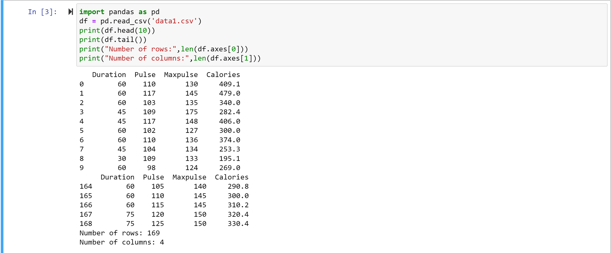

# Read-from-CSV

## AIM:

## ALGORITHM:
### Step 1:
### Step 2:
### Step 3:
### Step 4:
### Step 5:

## PROGRAM:
To write a python program for reading content from a CSV file.
Developed by: Rakesh J.S
Register Number: 22009339

import pandas as pd
df = pd.read_csv('data1.csv')
print(df.head(10))
print(df.tail())
print("Number of rows:",len(df.axes[0]))
print("Number of columns:",len(df.axes[1]))

## OUTPUT:

## RESULT:
